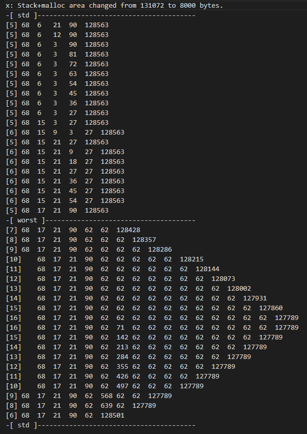

# Added option to change memory assignment algorithm between first fit and worst fit

#### Changed files:

```
src/
├── fs/
│   └── table.c
├── mm/
│   ├── alloc.c  - syscalls (458 485) alloc_mem (50)
│   ├── proto.h
│   └── table.c
include/
├── minix/
│   └── callnr.h
```

## Testing the solution with:
-   t.c
-   w.c
-   x.c
-   script.sh

## Result in [result.txt](result.txt) :

