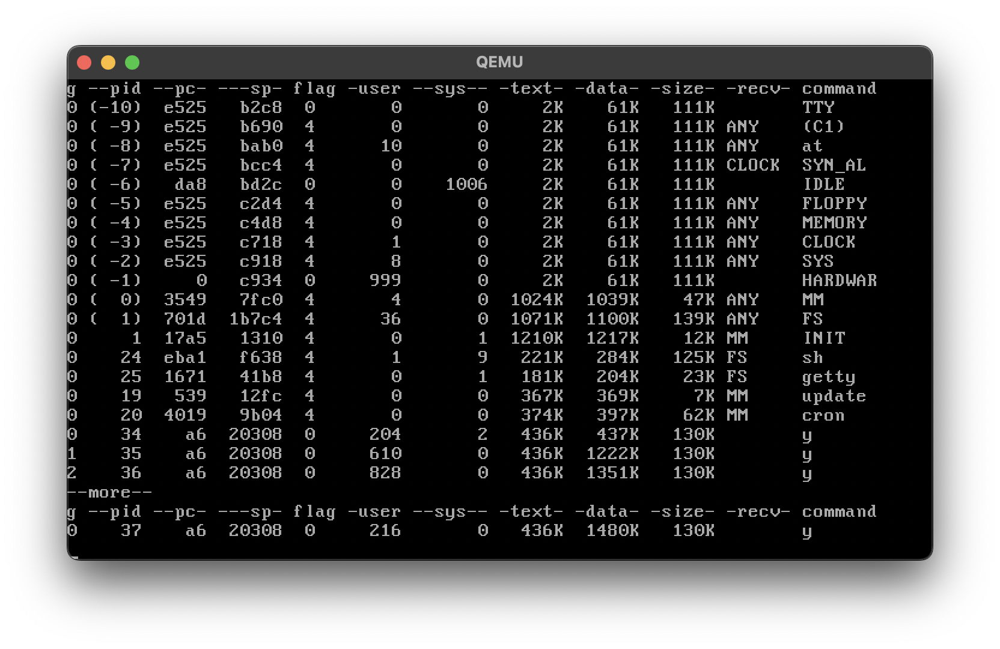

# Task done
Changed scheduling to weighed round-robin.

Processes from:
-   group A - 1 quant
-   group B - 2 quants
-   group C - 3 quants

test file - [test](minix_usr/src/soi/test.c)

column `-user` displays quants of time granted
column `g` displays group of the process

In this case there are 2 processes from group A(0) 1 from B(1) and 1 from C(1)
In a cycle two processes from group A get 1 quant combined, from group B 2 quants and from group C 3 quants.
For some reason tho it adds 1 quant to every process so the result is 2/3/4 instead of 1/2/3.