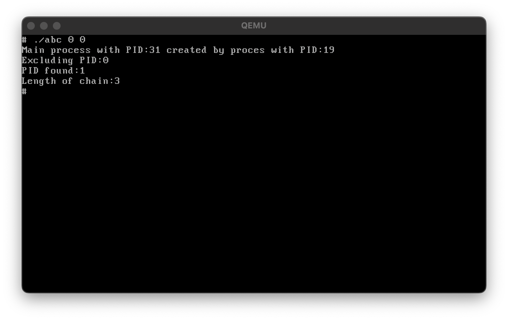
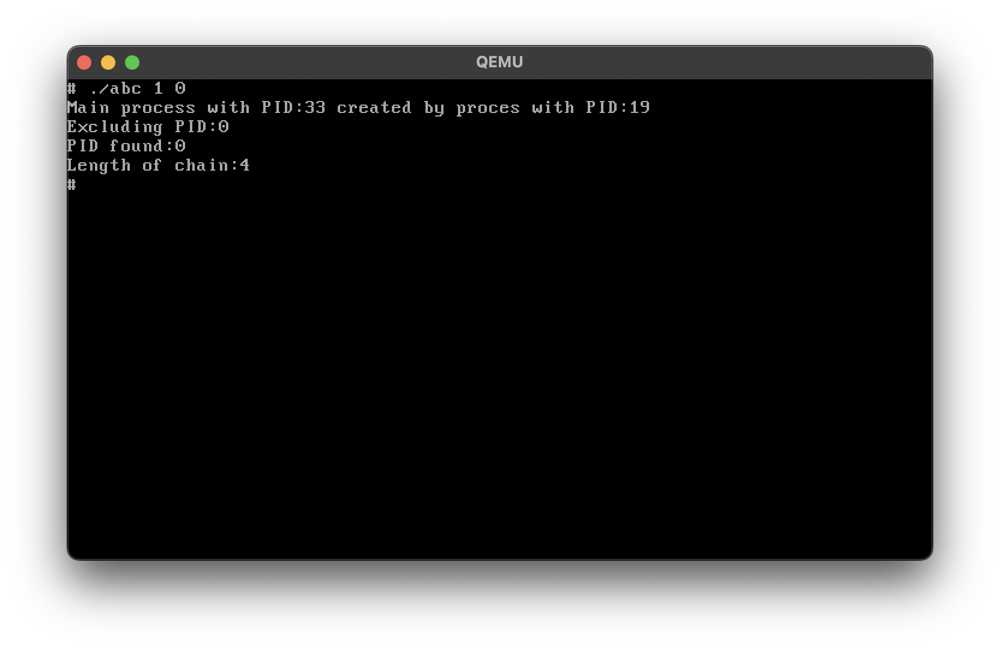
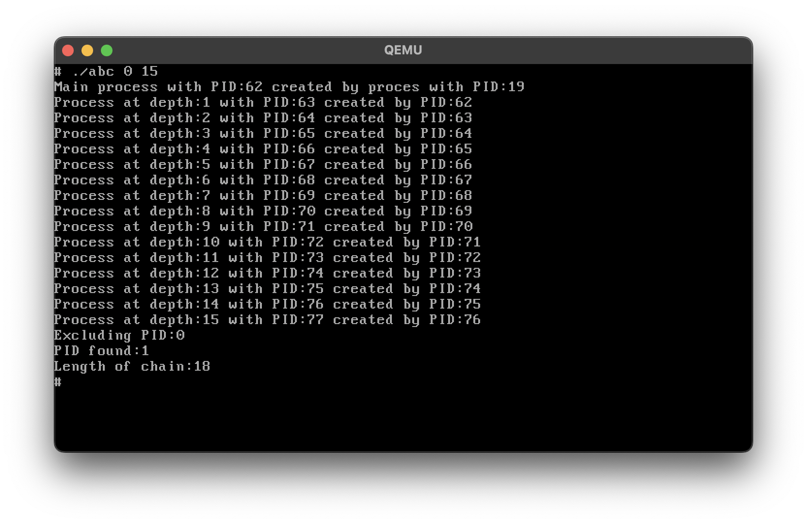

# Task done:
Added a syscall named `do_test` that finds the process with the longest chain of descendants and the length of the chain.

[Added syscall](src/mm/misc.c)
[test file](test.c)

# Screenshots
-	
-	
-	
